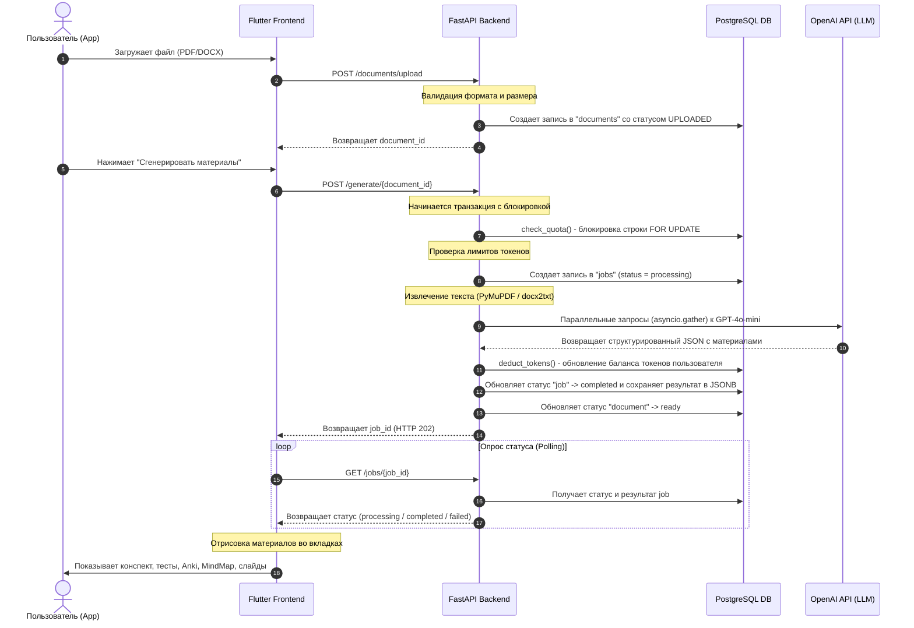

# Mentora AI — Описание проекта (Концептуальный и технический обзор)

**Mentora AI** (версия 2.0.0) — это интеллектуальная образовательная платформа, использующая большие языковые модели (LLM) для автоматического создания структурированных учебных материалов на основе лекций и учебных текстов, загружаемых пользователем.

Платформа решает проблему нехватки времени у преподавателей на подготовку учебных материалов (тестов, презентаций, конспектов) и помогает студентам автоматизировать процесс самоподготовки и интервального повторения.

---

## 1. Смысловой (концептуальный) план проекта

Mentora AI выступает в роли цифрового методиста, который за считанные секунды превращает сырой текст лекции или сложный документ в структурированную образовательную экосистему.

### Основные возможности для пользователя:
1. **Автоматический конспект (Summary)**: 
   Генерируется подробный текстовый конспект. Язык изложения адаптируется под целевой уровень сложности лекции (например, для новичков приводятся простые аналогии, а для продвинутых — глубокие технические подробности).
2. **Адаптивные тесты (Quizzes)**: 
   Создается тест из 10 вопросов разного уровня сложности с четырьмя вариантами ответов для мгновенной проверки знаний.
3. **Карточки для запоминания (Anki Flashcards)**: 
   Генерируется набор из 10 карточек по принципу активного вспоминания (Active Recall). Каждая карточка содержит краткий вопрос на лицевой стороне, развернутый ответ на обороте и тематические теги. Карточки готовы для экспорта в Anki или для тренировки прямо в интерфейсе.
4. **Ментальные карты (Mind Map)**: 
   Строится иерархическая структура лекции (до 3 уровней вложенности) для визуального понимания взаимосвязей между темами.
5. **Готовые презентации (Presentation Slides)**: 
   Разрабатывается структура презентации из 6 слайдов, содержащая заголовки, ключевые тезисы и подробные заметки для спикера (что говорить во время выступления).
6. **Рекомендация источников (External Sources)**: 
   Подбираются реальные и проверенные внешние ресурсы (статьи в Википедии, книги, курсы) для более глубокого изучения темы.

### Целевая аудитория:
* **Студенты**: Быстрое повторение материала перед экзаменами, самопроверка с помощью тестов и карточек Anki.
* **Преподаватели**: Мгновенная подготовка презентаций к занятиям, генерация домашних заданий, тестов и наглядных ментальных карт.

---

## 2. Техническая архитектура

Проект построен по клиент-серверной архитектуре и разделен на два независимых репозитория: асинхронный API-сервер на Python и мобильное приложение на Flutter.

### Схема взаимодействия компонентов

---

## 3. Подробный стек технологий и устройство Backend

Backend написан на **Python 3.10+** с использованием асинхронного фреймворка **FastAPI**.

### Основные компоненты и библиотеки:
* **FastAPI**: Обеспечивает высокую производительность за счет асинхронной обработки запросов. Поддерживает автоматическую документацию OpenAPI (доступна по пути `/docs`).
* **SQLAlchemy & asyncpg**: Используется асинхронный ORM для работы с СУБД PostgreSQL. Все запросы выполняются неблокирующим образом.
* **Pydantic**: Используется для декларативной валидации входящих запросов и формирования строгих схем ответов.
* **Alembic**: Управляет версионированием и миграциями структуры базы данных PostgreSQL.
* **PyMuPDF (fitz)** и **docx2txt**: Библиотеки для парсинга загруженных файлов и извлечения из них чистого текста.
* **OpenAI SDK (AsyncOpenAI)**: Взаимодействие с языковыми моделями (по умолчанию `gpt-4o-mini`).

### Модель данных (База данных PostgreSQL):
1. **`users`**: Хранит данные учетных записей (email, хеш пароля bcrypt, имя, флаг активности) и роль пользователя (`student`, `teacher`, `admin`).
2. **`user_quotas`**: Контролирует лимиты использования API. Содержит суточные (`daily_token_limit`) и месячные (`monthly_token_limit`) лимиты, а также счетчики текущего потребления токенов.
3. **`documents`**: Метаданные файлов (оригинальное имя, тип `pdf`/`docx`, размер в байтах, извлеченный текст, хеш текста для предотвращения дубликатов, статус обработки).
4. **`jobs`**: Хранит информацию о запущенных задачах генерации. Поле `result` имеет тип **JSONB** (PostgreSQL-native JSON), что позволяет сохранять структурированные ответы OpenAI любой сложности без создания десятков связанных таблиц.
5. **`usage_records`**: Детальный лог каждого обращения к ИИ (количество потраченных prompt и completion токенов, использованная модель и расчетная стоимость в USD).

### Оптимизации и ключевые решения в Backend:
1. **Параллельная генерация (asyncio.gather)**: 
   В файле `services.py` генерация разделена на два независимых промпта. Первый собирает текстовый конспект, уровень сложности лекции и тест. Второй собирает карточки Anki, ментальную карту, слайды презентации и внешние источники. Благодаря `asyncio.gather`, запросы выполняются к OpenAI параллельно, что сокращает время генерации материалов для пользователя примерно с ~30 секунд до ~12-15 секунд.
2. **Безопасное списание квот (Row-level locking)**: 
   В `app/billing/service.py` перед генерацией и после списания токенов применяется конструкция `SELECT ... FOR UPDATE` (`.with_for_update()`). Это блокирует строку конкретного пользователя в таблице квот на время проверки/обновления баланса, гарантируя защиту от **Race Conditions** (когда пользователь делает несколько одновременных запросов, пытаясь обойти лимиты).
3. **Безопасная регистрация пользователей**: 
   Пароли хешируются с использованием `bcrypt`. Перед хешированием пароль принудительно обрезается или проверяется, чтобы обойти ограничение библиотеки `bcrypt` на длину входной строки в 72 байта (что часто приводит к ошибкам при использовании длинных паролей).
4. **Регистрация ENUM в SQLAlchemy**: 
   Для корректного маппинга перечислений Python в нативные типы PostgreSQL ENUM (такие как `user_role`, `file_type`, `job_status`) используется параметр `values_callable=lambda obj: [e.value for e in obj]`. Это гарантирует, что в БД записываются нижние регистры (например, `'student'`), даже если в Python используются стандартизированные капс-константы.

---

## 4. Подробный стек технологий и устройство Frontend

Frontend представляет собой кроссплатформенное приложение на фреймворке **Flutter** (на языке **Dart**).

### Устройство клиента:
* **State Management (Управление состоянием)**: 
  Используется паттерн **Provider** (`ChangeNotifier`). В приложении выделено два ключевых провайдера:
  * `AuthProvider`: отвечает за авторизацию, проверку жизненного цикла JWT-токенов, сохранение сессии на устройстве и логаут.
  * `GenerationProvider`: управляет состояниями загрузки файлов, отправки запросов на сервер, прогрессом генерации (Stage) и хранением полученных структурированных результатов.
* **Маршрутизация (AuthGate)**: 
  Приложение автоматически проверяет наличие сохраненного токена при старте. Если пользователь авторизован — открывается `HomeScreen`, если нет — `LoginScreen`.
* **Сетевой слой**: 
  Все запросы отправляются с добавлением JWT-токена в заголовки `Authorization: Bearer <token>`. Имеется автоматический перехват ошибок сервера.

### Архитектура UI-компонентов:
* **Dark-theme интерфейс**: Стильный современный дизайн в темно-синих тонах (`Color(0xFF0A0E21)` и `Color(0xFF1D1F33)`).
* **Слайдер уровня сложности**: Позволяет пользователю вручную выбрать целевой уровень изложения материала перед запуском генерации.
* **Интерактивные вкладки на экране результатов**:
  1. **Конспект**: Поддерживает быстрое переключение между Базовым, Упрощенным и Расширенным стилями текста.
  2. **Тесты**: Интерактивный квиз. Пользователь может кликать по вариантам ответа. После нажатия "Проверить ответы" интерфейс подсвечивает правильные варианты зеленым цветом, а ошибки — красным, выводя итоговый балл.
  3. **Anki**: Виртуальная карточка, которая «переворачивается» по тапу на экран, показывая ответ на вопрос лекции.
  4. **Источники**: Список полезных ссылок с разделением по типам (статьи, видео, формулы). Кликая по ссылке, приложение с помощью библиотеки `url_launcher` открывает страницу в системном браузере.
  5. **MindMap**: Динамическое интерактивное дерево. При нажатии на родительский узел ветка раскрывается/скрывается с помощью внутреннего состояния `node.isExpanded` и обновления виджетов.
  6. **Презентация**: Список карточек-слайдов с визуально отделенными блоками заметок для спикера.

---

## 5. Перспективы развития проекта

1. **Фоновая обработка задач (Celery / Arq)**: 
   В данный момент в целях упрощения структуры и ускорения отладки генерация выполняется в синхронном потоке запроса (с удержанием соединения). В продакшене эту задачу планируется вынести в фоновые воркеры (например, с использованием Redis и библиотеки Arq / Celery), чтобы API моментально возвращало ответ `202 Accepted`, а клиент опрашивал статус в фоновом режиме.
2. **Экспорт материалов**:
   * Экспорт карточек Anki напрямую в формате `.apkg` (готовых для импорта в десктопное или мобильное приложение Anki).
   * Экспорт конспектов в PDF/Markdown.
   * Экспорт презентации в формат PowerPoint (`.pptx`).
3. **Мультимодальность**:
   * Возможность загружать не только текстовые файлы, но и аудиозаписи лекций (с последующей транскрибацией через OpenAI Whisper).
   * Поддержка изображений и формул в конспектах и ментальных картах.
